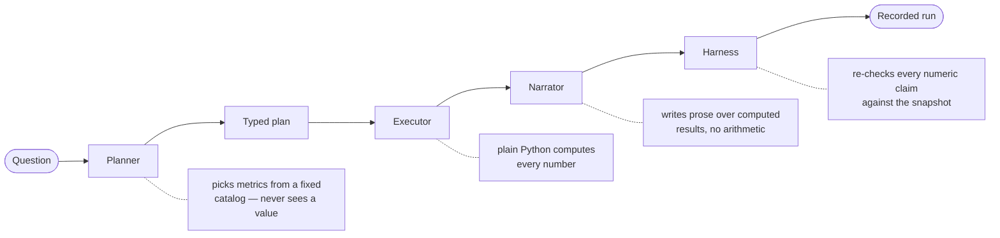

<div align="center">

# MJ Research

**Local-first equity research where the language model never produces a number.**

[](https://github.com/karanmjpinto/mjresearch/actions/workflows/ci.yml)
[](LICENSE)
[](https://www.python.org/downloads/)
[-orange.svg)](https://ollama.com)

[Live landing page](https://karanmjpinto.github.io/mjresearch/) · [Architecture](ai-hedge-fund/docs/architecture.md) · [Contributing](CONTRIBUTING.md)

</div>

---

## The problem

Most AI research tools hand a language model a pile of financial data and ask for a
verdict. That makes **every figure in the answer a token prediction** — the P/E ratio,
the drawdown, the conviction score. The output reads perfectly plausibly whether or
not the arithmetic happened, and you cannot tell which from the prose.

## The approach

This project compiles the question into a **typed program**, computes every figure in
plain Python, and lets the model write only over results it did not produce.



The model appears **twice, in two narrow roles**. A *planner* chooses what to measure
from a fixed catalog and is shown no values. A *narrator* is shown only computed
values, under an explicit no-arithmetic rule. When the plan computes a conviction
score it **overwrites** whatever the narrator wrote, and says so in
`harness_overrides`.

Then a deterministic pass re-reads the finished thesis, extracts each numeric claim,
and compares it against the snapshot. Claims it cannot map are reported
**`unverifiable`** — never as passing.

---

## Why you might care

| | |
|---|---|
| **Numbers you can check** | Every figure traces to a registered Python metric, not to the model. |
| **Runs you can replay** | Each analysis stores its snapshot, prompts, model parameters and output. Re-run it later against the same frozen data. |
| **Drift you can see** | `runs/compare` sets `nondeterminism_detected` when identical inputs reach different conclusions — the signal that an eval built on them would be measuring noise. |
| **Sources you can trace** | Providers disagree on split adjustment, fiscal alignment and currency. Every fetch records who answered, whether it was cached, and how the payload verified. |
| **No API keys** | Ollama serves the model locally, market data comes from keyless providers by default, and the book is a SQLite file you own. |

---

## Quick start

**Prerequisites:** [uv](https://docs.astral.sh/uv/), Node 20+, and [Ollama](https://ollama.com).

```bash
git clone https://github.com/karanmjpinto/mjresearch.git
cd mjresearch/ai-hedge-fund
ollama pull qwen3:30b
cp .env.example .env
./start.sh
```

`start.sh` brings up the API on `:8000` and the UI on `:5173`, waits for the API
before opening the browser, and stops both on Ctrl-C. It **warns rather than fails**
if Ollama is down — everything except AI research still works.

Then open **http://localhost:5173**.

<details>
<summary><b>Manual start, custom ports, and CLI</b></summary>

```bash
cd ai-hedge-fund
cp .env.example .env          # set OLLAMA_MODEL to a name from `ollama list`

uv sync --extra dev
uv run uvicorn hedge_fund.api.main:app --reload    # :8000

cd frontend && npm install && npm run dev          # :5173
```

Run a second instance beside one that is already bound — the UI proxy follows the
API port automatically:

```bash
./start.sh --api-port 8010 --ui-port 5174
```

Both instances share `./data/fund.db`, so two backends at once write to the same book.

One-off data check from the terminal:

```bash
uv run check-data AAPL
```

</details>

### Model choice matters

`qwen3:30b` is a mixture-of-experts model — ~30B total parameters but only ~3B active
per token, so it reasons far better than a small dense model at comparable speed.
Smaller models tend to write theses that cite none of the computed values. The harness
catches that and flags `narrative_grounded: false`, but a capable model avoids it in
the first place.

Prefer a hosted API? `uv sync --extra openai`, then set `LLM_PROVIDER=openai`,
`OPENAI_API_KEY` and `LLM_MODEL`.

---

## What it does

<details open>
<summary><b>Research</b></summary>

- **Plan-based analysis** — `POST /api/research/plan` compiles a question into a DAG
  of deterministic metrics, executes it, then narrates over the results. Node values
  are content-addressed, so re-running an edited plan recomputes only what changed.
- **Methodology clarifications** — closed-form questions with a recommended default,
  answered *before* execution so the choice is compiled into the plan rather than
  resolved silently mid-run.
- **Investor personas and committee mode** — multiple analysts plus a portfolio-manager
  synthesis. A committee that splits materially (conviction spread ≥ 30, or more than
  two distinct stances) goes to a **rebuttal round** against the *same unchanged
  snapshot* before synthesis, so a real disagreement is examined rather than averaged
  away. Peers are anonymised, and total convergence in one round sets
  `suspect_convergence` rather than reading as confirmation — the failure mode being
  managed is agreement, not disagreement.
- **News sentiment** — headlines scored with [FinBERT](https://huggingface.co/ProsusAI/finbert)
  when `uv sync --extra sentiment` is installed; degrades to `enabled: false` otherwise.

</details>

<details>
<summary><b>Portfolio and risk</b></summary>

- Persistent book in `./data/fund.db` — trades, cash, splits, dividends, manual edits.
- **Value-weighted** daily-return risk: VaR, Sharpe, max drawdown.
- **Sizing against the book you already hold** — resulting weight, correlation to
  existing positions, concentration, and the effect on portfolio volatility. A volatile
  name can *lower* total risk if it moves differently; sizing it in isolation would call
  that a risk increase.
- Decisions are kept with the portfolio context they were made against, so a call
  reviewed a year later is judged against the book as it stood.

</details>

<details>
<summary><b>Quant</b></summary>

- **Backtesting** — six vectorised strategies (buy & hold, golden cross, RSI reversion,
  Bollinger breakout, trend-plus-drawdown, 6-month momentum). No look-ahead bias, 5 bps
  per side, full metrics and a round-trip log.
- **Portfolio construction** — equal weight, conviction weighted, inverse volatility,
  Markowitz max-Sharpe, and Hierarchical Risk Parity (López de Prado, 2016).
- **Autoresearch** — proposes one strategy at a time and judges it on a window it never
  saw, with the bar rising as more variants are tried, because searching enough variants
  against one price history will always turn something up. Discarded runs stay on the
  log; how many were tried is part of what the survivor means.

</details>

<details>
<summary><b>Data</b></summary>

- Multi-provider market data with fallback and caching, keyless by default.
- **SEC EDGAR** — SIC-classified peer groups and real filings (10-K, 10-Q, 8-K, Form 4,
  13F-HR, DEF 14A, SC 13G/D). No API key, just a descriptive `SEC_USER_AGENT`.
- **Provenance on every fetch** — which provider answered, cache status, and how the
  payload verified: frequency, date range, point count, units, adjustment basis.

</details>

<details>
<summary><b>Methodology memory</b></summary>

When an analysis comes out wrong, the durable lesson is usually the *method*, not the
number. `POST /api/methodology` stores a portable correction that later runs apply.

Notes containing prices, amounts or scores are **rejected** — a stored number would be
replayed onto runs where it is no longer true. `GET /api/methodology/applicable` shows
exactly what would enter a prompt right now, and each run records which notes shaped it.

</details>

---

## Use it from Claude Desktop, Cursor, or any MCP client

The whole stack is exposed as an **MCP server** with thirteen tools — `research_ticker`,
`plan_research`, `list_metrics`, `get_market_data`, `get_sec_filings`, `get_peers`,
`run_backtest_tool`, `optimize_portfolio`, `describe_research_graph`, `list_runs`,
`get_run`, `compare_runs`, `teach_methodology`.

```json
{
  "mcpServers": {
    "mjresearch": {
      "command": "uv",
      "args": ["run", "hedge-fund-mcp"],
      "cwd": "/absolute/path/to/mjresearch/ai-hedge-fund"
    }
  }
}
```

Restart the client, then ask it to *"research NVDA with the committee"* or *"run a
golden cross backtest on AAPL for 3 years"* and it will invoke the tools directly.

---

## What it does not do

This section carries the same weight as the one above it. A research tool that oversells
its certainty is worse than one that states plainly what it cannot do.

- **This is not investment advice.** Output is generated by a language model over public
  data and can be wrong in ways that read perfectly plausibly. Nothing here is a
  recommendation to buy or sell anything.
- **Verification has real gaps.** Numeric claims are only checked for metrics the
  verifier knows about. Anything outside that set counts as *unverifiable*, not verified.
  Qualitative claims are not checked at all.
- **Scoring bands are absolute.** Valuation scoring uses fixed thresholds rather than
  sector-relative ones, so a utility and a software company are judged on the same scale.
- **Determinism is bounded.** Sampling is greedy and seeded (`LLM_TEMPERATURE=0.0`,
  `LLM_SEED=7`) and every input is recorded, but providers do not guarantee identical
  output. Moving arithmetic out of the model narrows this — it does not eliminate it.
- **Data quality is inherited.** Fundamentals come from third-party providers that
  disagree with each other and are sometimes stale. Provenance tells you which source
  answered; it cannot tell you that source was right.
- **Committee mode is not audited.** Persona analyses run with full freedom rather than
  as weightings over computed dimensions, so their conviction scores are not reproducible
  the way the plan pipeline's are.

---

## Deployment

The published site at [karanmjpinto.github.io/mjresearch](https://karanmjpinto.github.io/mjresearch/)
is **the landing page only**. The backend is deliberately not hosted: the API has no
authentication and full write access to the portfolio, so putting it on the public
internet would expose the book and its trade endpoints to anyone with the URL. The model
is local too, so a hosted instance would have no AI research regardless.

App routes on the published site show the commands to run it locally. Everything real —
portfolio, data, model — stays on your machine.

Railway deployment instructions live in [`ai-hedge-fund/README.md`](ai-hedge-fund/README.md).

---

## Repository layout

```
.
├── ai-hedge-fund/            # the application
│   ├── src/hedge_fund/       # FastAPI backend, agents, quant, data, MCP server
│   ├── frontend/             # React + Vite + Tailwind UI
│   ├── tests/                # pytest suite
│   ├── docs/architecture.md  # full design document
│   └── README.md             # operational detail: env vars, API reference, Railway
├── .github/workflows/        # CI, GitHub Pages deploy
└── LICENSE
```

Full API reference, the complete environment-variable table, and deployment detail are
in [`ai-hedge-fund/README.md`](ai-hedge-fund/README.md). The design rationale is in
[`ai-hedge-fund/docs/architecture.md`](ai-hedge-fund/docs/architecture.md).

## Tests

```bash
cd ai-hedge-fund
uv run pytest -q          # 304 tests
```

CI runs Ruff, pytest, a frontend build, and a design review on every push and PR.

## Contributing

Issues and pull requests are welcome — see [CONTRIBUTING.md](CONTRIBUTING.md) for the
development setup and what makes a change easy to merge. Security reports go through
[SECURITY.md](SECURITY.md), not the public tracker.

## Credits

The investor-persona and committee/portfolio-manager ideas are inspired by the
educational multi-agent design in [virattt/ai-hedge-fund](https://github.com/virattt/ai-hedge-fund)
(MIT). This is an independent codebase, not a fork; the system prompts are original text.
See [`ai-hedge-fund/third_party/ATTRIBUTION.md`](ai-hedge-fund/third_party/ATTRIBUTION.md)
for the full attribution.

## License

[MIT](LICENSE) © karanmjpinto
